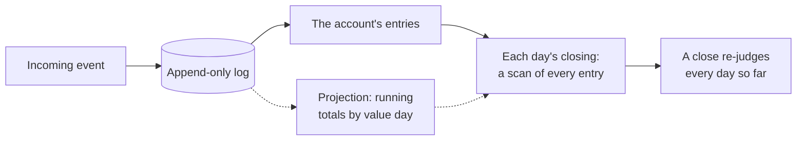
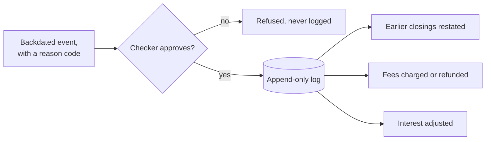
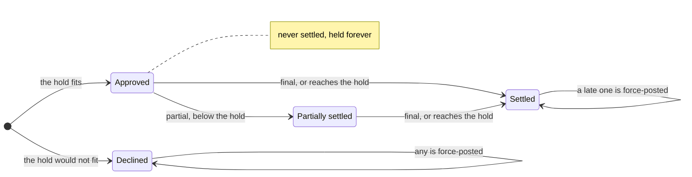

# Architecture Trade-Offs

Why the ledger is built the way it is, what that costs, and what it leaves for production. Every claim here is about the
code in [`apps/account-ledger-cli`](../../apps/account-ledger-cli/README.md) as built; its structure is drawn in the
[architecture](../../specs/apps/account-ledger/cli/architecture.md), and each rule it follows is resolved, with its
test, in [AMBIGUITIES](../../AMBIGUITIES.md).

## Append-only at scale

The ledger keeps one append-only log and stores no balance. Every figure, a closing, an available balance, accrued
interest, is worked out, when it is asked, by a method of the Account aggregate that scans the account's own entries,
taken from the one log. That is what makes a backdated event cheap to get right: nothing stored has to be found and
corrected, because nothing is stored.

It is also what breaks first. A day's close re-evaluates fees and interest for every day from the first day of the
window through today, and each of those days asks for its closing, which scans every one of the account's entries. One
close therefore costs days × entries, and processing D days costs about D³ once the log grows with the days. The log is
also a tuple, so each append copies it. Measured on 2026-09-25, on a laptop, once the rules had moved onto one account's
entries, with a scratch stream of ten alternating credits and debits a day on one account, each value-dated on its
booking day, and interest capitalized every thirtieth day; measured again after the code was restructured into layers,
and again after its last two fixes, no figure moved by more than a fifth:

| Window   | Events | Processing time |
| -------- | ------ | --------------- |
| 6 days   | 60     | 0.01 s          |
| 30 days  | 300    | 0.46 s          |
| 60 days  | 600    | 3.50 s          |
| 120 days | 1,200  | 26.89 s         |

**What breaks first at 100× volume is the day's close, in processing time, well before memory.** A hundred times the
brief's events inside its six days, each repeated under new IDs, is processed in 0.71 s. A hundred times its daily
volume, 170 events a day, takes 10.1 s over 30 days and 69.2 s over 60, at a peak of 31 MB and then 41 MB: doubling the
window multiplies the time by about seven but the memory by a third. A bank runs its close against a deadline, so the
close misses it first; extrapolated at that rate, a year of days would run for hours.

The state grows without bound in three places:

- **The log.** It holds every entry since the first day, and every query reads all of its account's entries.
- **The window.** Fees and interest are re-judged for every day since the first, so each close does more work than the
  last, forever.
- **The snapshots.** Processing keeps the log as it stood at every day's close; the entries are shared, but each
  snapshot's references grow with days × entries.

The cheapest structural change that defers this is a projection: a running total of each account's movements by value
day, updated on every append, with each closing read as a prefix sum over it. It belongs to the Account aggregate, kept
beside the account's entries, and the methods that scan those entries for a balance read it from the projection instead.
It changes no rule's logic and no output; a close still re-judges every day, but each judgement becomes a lookup rather
than a scan, which takes processing from about D³ to about D². The log stays the source of truth, and the projection can
be rebuilt from it at any time. What it does not fix is the ever-growing window. That needs a business decision, not a
data structure: a period close after which a day is sealed, and a backdated event older than the seal posts its effect
into the open period instead of reopening old days. That changes what the ledger reports, so finance and compliance
decide it, not the code alone.

## Value-dated entries in production

A value date lets an event land on a day that has already closed. In this ledger that one event re-opens every closing
from its value date onward: earlier days' closings are restated in the day's report, fees are charged for days that turn
negative and refunded for days that recover, and interest already accrued for those days is adjusted up or down. Every
one of those consequences is correct, and every one is visible to a customer, an auditor, or a regulator.

The operational surface:

- **Statements and notices.** A customer holding a statement for a day may later see that day's closing change, and a
  fee appear or vanish, with no new activity of their own. Each restatement needs a notice the customer can understand.
- **Interest and fees.** A backdated debit can create an overdraft that earns a fee and reverses interest already
  accrued; a backdated credit can undo both. Complaints follow the fee, not the entry that caused it.
- **Reconciliation.** Card clearing, transfers, and returns arrive days after the value dates they carry. Each is a
  backdated entry, so reconciliation with the card networks and correspondent accounts runs on value dates, not booking
  dates.
- **Calendar.** The UAE weekend is Saturday and Sunday. A value date on a non-business day, and the cut-off that decides
  which day an event is booked on, have to be defined, and this ledger's integer days define neither.

The regulatory surface, for a bank the Central Bank of the UAE licenses and supervises:

- **Consumer protection.** The Central Bank's consumer-protection rules expect fees and charges to be disclosed and
  applied fairly. A fee charged for a past day, value-dated today, is exactly the kind of charge a customer disputes;
  the bank must be able to show why it arose and when it was refunded.
- **Reported figures.** Returns to the regulator and the bank's financial statements are prepared as of a date. An entry
  value-dated inside a period already reported changes that period's balances after they were filed.
- **Financial crime.** Backdating is a way to move money across a reporting date or to avoid a charge. The AML/CFT
  framework expects the bank to be able to show who made each entry, when, and why.
- **Audit trail.** The append-only log helps here: nothing is overwritten, and every restated figure can be traced to
  the entry that moved it. It records what happened, but not who did it or on whose authority.

**The one control to add before going live: maker-checker approval for any value date earlier than the booking day.**
The first person enters the backdated event with a reason code, and a second, authorized person approves it before it
reaches the log. The log then records who made and who approved every entry that restates the past, which answers the
audit, consumer-protection, and financial-crime questions together, and a backdated fee or restated statement can be
explained to the customer from the reason code.

## Authorization lifecycle

An authorization is in one of four states: approved, partially settled, declined, or settled. The model ends one in
these ways other than a settlement that matches its hold:

| Ends by                        | In the model                                                                |
| ------------------------------ | --------------------------------------------------------------------------- |
| declined on arrival            | its hold does not fit the available balance; nothing is held                |
| refused for a reused ID        | an authorization under an ID already used is refused on arrival (AMB-038)   |
| settled for less than the hold | a final settlement debits its amount and releases the whole hold (AMB-013)  |
| settled for more than the hold | the full amount is debited, and the balance may go negative (AMB-030)       |
| partial settlements            | each keeps the rest on hold; one reaching the hold, or a final one, settles |
| never settled                  | the hold stays forever, the known weakness (AMB-018)                        |
| voided by the merchant         | not possible: a reversal of an authorization is refused (AMB-035)           |
| its settlement reversed        | the debit is undone; the authorization stays settled (AMB-035)              |
| a settlement after it ended    | a force-post: the amount is debited and no hold is released (AMB-029)       |

For each, what it represents and what the bank should mandate:

- **Declined on arrival.** A card payment refused for lack of funds. Mandate: record the decline and its reason, and
  treat any later clearing against it as a force-post that goes to a dispute queue, since the bank may have a right to
  charge it back.
- **Refused for a reused ID.** A clearing system that re-sends an authorization under a new message, or a short
  authorization code that repeats across merchants. Mandate: key every hold by the card network's unique transaction
  identifier, never the short code, and route a clash to review, since a merchant may still clear against it.
- **Settled for less.** A fuel pump or restaurant pre-authorization cleared for the actual bill. Mandate: release the
  remainder at once, as the model does; a customer should never wait for money the merchant did not take.
- **Settled for more.** A tip or a hotel's incidentals. Mandate: accept an overage within the card network's tolerance
  for that merchant category; beyond it, post the excess as a force-post and review it, and never let the overage alone
  trigger a fee without that review.
- **Partial settlements.** A split shipment. Mandate: keep the rest on hold, as the model does, but give the remainder
  the same lifetime as any hold, so an order never finished does not hold money forever.
- **Never settled.** A cancelled order or an abandoned rental whose merchant never clears. Mandate: a hold-expiry event
  generated at the close after the network's time frame for the merchant category; Visa's longest is 30 calendar days
  ([NUMBERS](../../NUMBERS.md)). The failing test records this gap, and a clearing that arrives after expiry is a
  force-post.
- **Voided by the merchant.** A merchant cancels before clearing. Mandate: an authorization-reversal event that releases
  all or part of the hold, idempotent on the network's reference, distinct from the operator's reversal of a posting.
- **Its settlement reversed.** An operator's correction of a posting made in error. Mandate: keep reversal for
  corrections only; a customer refund or a chargeback is a new credit linked to the authorization, so the reason for the
  money's return stays on the record.
- **A settlement after it ended.** A late or second clearing. Mandate: post it, since the network settles with the bank
  regardless, and route it to review with the authorization it names.

## What you cut and why

Each cut kept the build to what the brief asks without leaving a resolved rule unproven, and each defers a production
risk.

| Cut                                    | Production risk deferred                                                  |
| -------------------------------------- | ------------------------------------------------------------------------- |
| persistence: the log lives for one run | a crash loses everything; there is no durable record to recover           |
| a stored balance: every figure scans   | processing cost grows with the cube of the window, as shown above         |
| a hold lifetime (AMB-018)              | money is held forever for a merchant who never clears                     |
| a merchant's void of an authorization  | a cancelled payment keeps its hold until an operator works around it      |
| a fee waiver                           | a reversed fee on a day still negative is charged again at the next close |
| a quarantine for a live stream         | one malformed row stops all processing, and a live feed cannot stop       |
| a clock                                | no cut-off or time zone; a day closes when the stream passes it           |
| a calendar: days are integers          | no weekends, holidays, or day-count convention for interest               |
| product configuration                  | every fee or rate change is a release, and no rate has an effective date  |
| two currencies, no exchange            | a card spend in another currency cannot be posted                         |
| one fixed rate for the BHD fee         | the BHD 2.560 fee (AMB-027) drifts from AED 25.00 if either rate moves    |
| an overdraft limit                     | any debit or settlement posts however far below zero; fees are the brake  |
| one process, one ordered stream        | no ordering or locking across sources posting to one account at once      |
| a machine-readable report              | downstream systems would parse text meant for people                      |
| operator identity                      | a reversal or backdated entry cannot be traced to the person who made it  |
| incremental authorization              | an extended hotel stay needs a second authorization and a second hold     |
